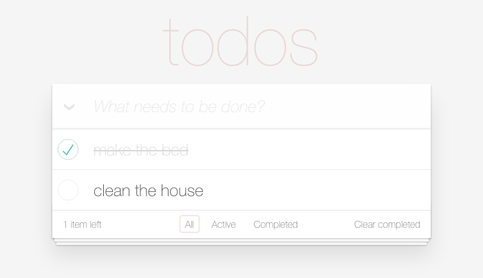

# Enhance an existing project
## OpenClassRooms Project 8 - FrontEnd Degree
### Jasmine, JavaScript, Optimisation, Performance, Technical Documentation


* Step 1: Fix the bugs
* Step 2: Add tests
* Step 3: Analyze performance
* Step 4: Write technical documentation


### To run the application
```npm
npm install
open index.html in any browser
```


### Example Code
```javascript
function Todo(name) {
		this.storage = new app.Store(name);
		this.model = new app.Model(this.storage);
		this.template = new app.Template();
		this.view = new app.View(this.template);
		this.controller = new app.Controller(this.model, this.view);
	}

	var todo = new Todo('todos-vanillajs');
	function setView() {
		todo.controller.setView(document.location.hash);
	}
```

#### By Debbie O'Brien
27 October 2017